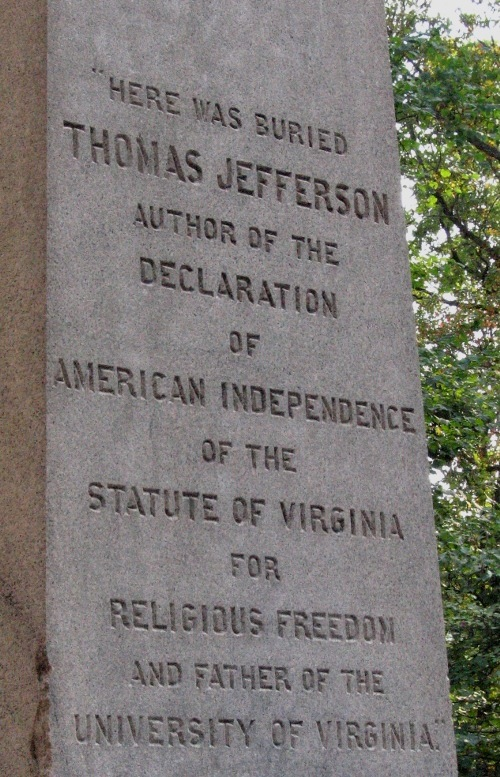

% Religious Pluralism and the American State
% Lincoln Mullen
% Brandeis University, Fall 2012

## Course Details

---------------     --------------------------------------------
course number:      UWS 1A-1

meeting time:       Mondays, Wednesdays, 9:00--9:50 a.m. (see calendar)

class location:     TBA

course website:     <http://lincolnmullen.com/courses/uws.2012-fall/>

instructor:         Lincoln Mullen

e-mail:             <lmullen@brandeis.edu>

office:             Rabb 358

office hours:       after class, 10 a.m. -- 12 p.m. and by 
                    appointment; virtual office hours TBA

phone:              781-330-0171

instructor web:     <http://lincolnmullen.com>

Twitter:            [@lincolnmullen](https://twitter.com/lincolnmullen)

mailbox:            History Department, Olin-Sang, second floor
---------------     --------------------------------------------

## Course description

Two of the most pressing questions about American religion and its
public role are intertwined: how should religions relate to one another,
and how should religions be related to the state? Students in this class
will take up these two questions through the historical analysis of
texts about the interactions of Protestant, Catholic, Jewish, Mormon,
and Native American religions with one another and with the federal and
state governments. They will investigate how law has regulated the
public sphere and the civil square in which religious interactions take
place, but also how religious actors have driven those interactions. We
will trace the history of American pluralism, from the fact of diversity
in eighteenth century to the idea of pluralism in the twenty-first
century. Students will write three essays: one expositing a document
about a religious conflict, a second interacting with other historians'
interpretations, and a third based on original research into religious
conflict.

## Learning goals

After taking this course, you will be able to

+   write argumentative essays based on your reading in primary and
    secondary sources,
+   revise your own writing,
+   explain the history of religious pluralism and religious liberty in
    the United States,
+   read and interpret a primary source as a historian, and
+   understand and evaluate the arguments and interpretations of a work
    of history.

## Texts

You will read a number of primary sources, which will be available in a
course pack or on the website. You can purchase the course pack
at cost in class, and it will be available on the website as well.

The following books on writing are required:

> Williams, Joseph M., and Gregory G. Colomb. *Style: Lessons in Clarity
> and Grace*. 10th ed. Boston: Longman, 2010. ISBN: 0205747469. \*

> Parfitt, Matthew. *Writing in Response*. 1st ed. Boston: Beford/St.
Martin's, 2011. ISBN: 0312403933. \*

We will read most of the following books by historians. I recommend that
you purchase them, but you can obtain them by other means:

> Green, Steven. *The Second Disestablishment: Church and State in
> Nineteenth-Century America*. New York: Oxford University Press, 2010.
> ISBN: 0195399676. \* †

> Hutchison, William R. *Religious Pluralism in America: The Contentious
> History of a Founding Ideal*. New Haven: Yale University Press, 2003.
> ISBN: 0300105169. \* †

> Sehat, David. *The Myth of American Religious Freedom*. New York:
> Oxford University Press, 2011. ISBN: 0195388763. \* †

We will use the following style guide as a reference. It is available on
the course website:

> Strunk, William, and John Austin Matzko. “William Strunk’s *Elements
> of Style* for Students of History.” 2008.

A good dictionary is invaluable. The *AHD* is available for purchase,
but it is optional:

> *The American Heritage Dictionary of the English Language*. 5th ed.
> Boston: Houghton Mifflin Harcourt, 2011. ISBN: 0547041012. \* 

\*	*Available for purchase in the bookstore, and elsewhere.*  
†	*On reserve in the Goldfarb Library.*

## The intellectual work of the course

The intellectual work of this course is centered on understanding the
problem of religious pluralism and religious liberty as it relates to
the American state. You will engage that intellectual problem in two
ways. 

First, you will *read* documents throughout American history
written by people who worked through the questions of religious liberty
and religious pluralism. You will also read the works of
historians who have read the same documents and who offer 
interpretations of the past.

Second, you will *write* your own interpretative essays grounded in your
reading of primary and secondary sources. Specifically, you will
complete three major writing assignments and accompanying pre-draft
assignments:

1. a close-reading essay, a 5--6 page essay interpreting a historical
   text;

2. a lens essay, a 7--8 page essay applying and engaging with a
   historian's argument about primary texts; and

3. a research essay, a 10 page essay based on your own research into
   primary and secondary texts.

You will also complete a number of other requirements:

+   a portfolio, which collects your work for the course into one
    package, for you to assess how you have developed as a writer;

+   three 20-minute conferences with me, one for each of your essays;

+   peer-review workshops, where you will help your colleagues in the
    class develop their writing; and

+   a number of practice writing assignments in-class or online (which
    will count towards your participation grade).

I will give you detailed instruction and help with all assignments in
class and in handouts.

## Evaluation

I will evaluate your intellectual work in the following categories:

------------------------        --------
assignment                      weight
------------------------        --------
close-reading essay             15%

lens essay                      20%

research essay essay            30%

pre-draft assignments           15% 

portfolio                        5%

participation                   15%
------------------------        --------

## Additional information

Please see the included schedule for the calendar of readings and the
due dates for assignments. Please see the attached policies sheet for
other duties and expectations.

*Acknowledgments:* This syllabus borrows ideas, assignments, wording,
and texts from Josh Cracraft, Kevin Doyle, and John Matzko.

*Copyright and license:* This syllabus and all assignments are &copy;
copyrighted by Lincoln Mullen, 2012. They are released under a Creative
Commons Attribution 3.0 United States (CC BY 3.0) license
<<http://creativecommons.org/licenses/by/3.0/us/>>. You are free to use
or modify this syllabus for any purpose, provided that you attribute it
to the author, preferably at the course website listed above.
